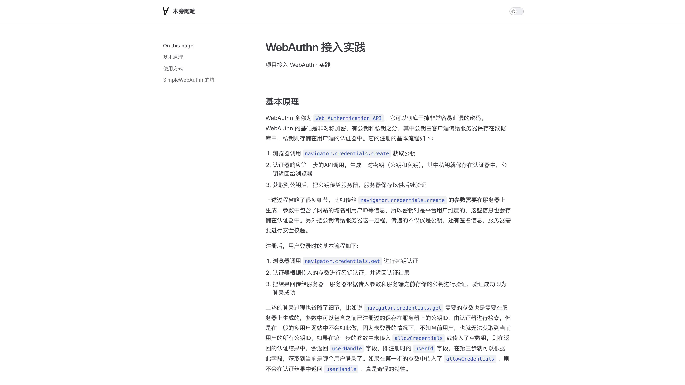
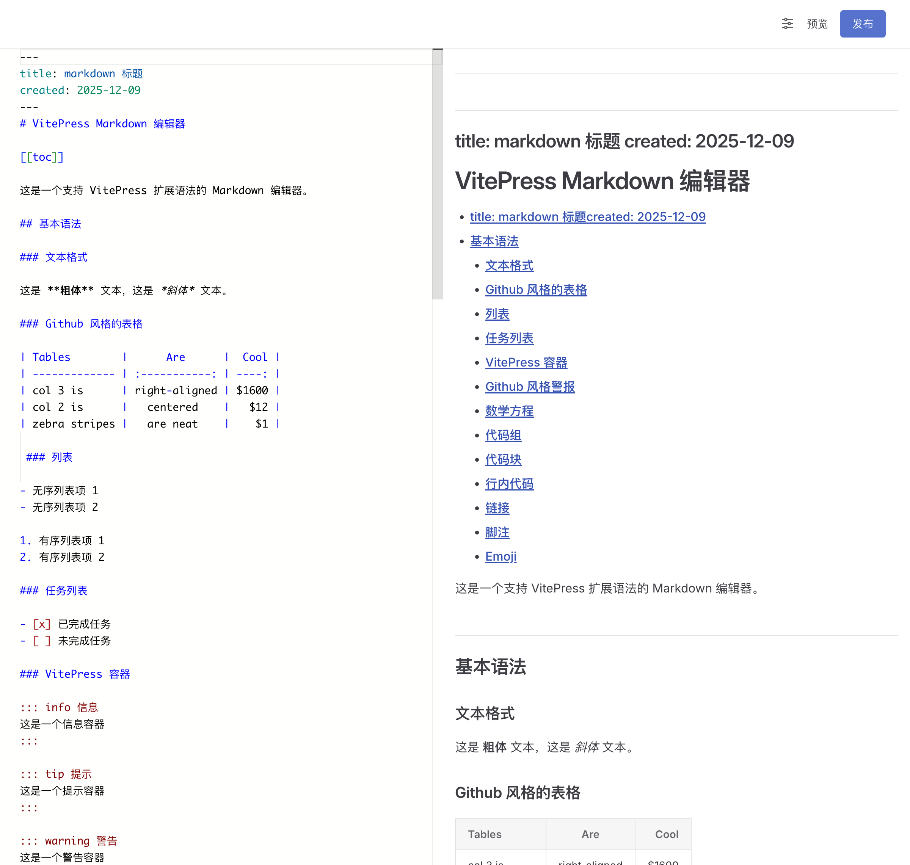
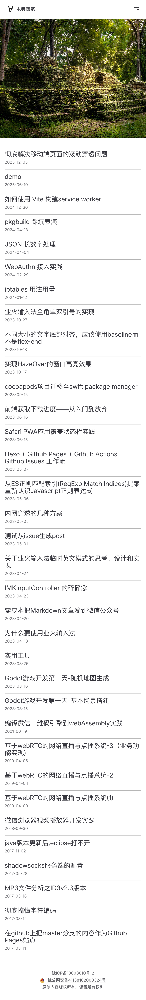
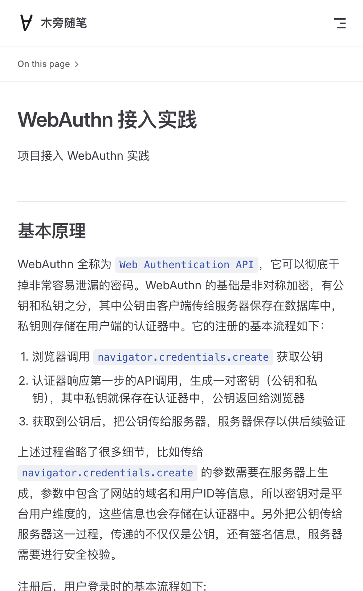
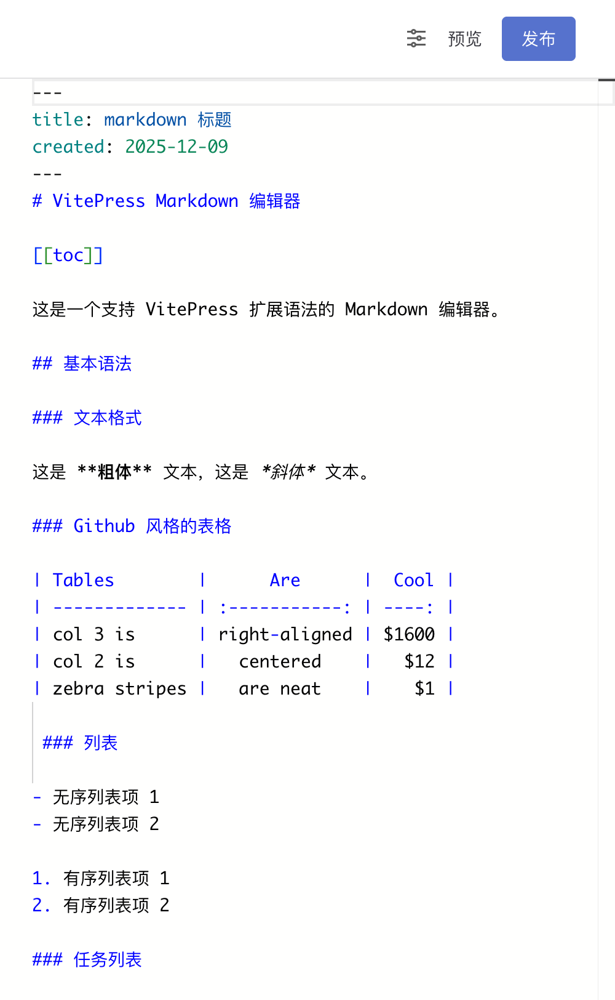

# 木旁随笔

> 一个基于 VitePress 构建的个人技术博客

🏠 **博客地址**: [https://qwertyyb.github.io](https://qwertyyb.github.io)
✏️ **编辑地址**: [https://qwertyyb.github.io/editor.html](https://qwertyyb.github.io/editor.html)

## 📝 项目简介

这是我的个人技术博客，主要分享前端开发、编程实践和思考总结。博客基于 [VitePress](https://vitepress.dev/) 构建，提供了简洁优雅的阅读体验。

## 📸 效果预览

### 桌面端

#### 博客首页


#### 文章阅读


#### 在线编辑器


### 移动端

#### 博客首页（移动端）


#### 文章阅读（移动端）


#### 在线编辑器（移动端）


## 🚀 技术栈

- **构建工具**: VitePress 2.0
- **框架**: Vue 3
- **包管理器**: pnpm
- **样式**: Sass
- **Markdown 编辑器**: Monaco Editor

## 📁 项目结构

```
qwertyyb.github.io/
├── .vitepress/          # VitePress 配置文件
│   └── config.mts       # 站点配置
├── src/                 # 博客内容
│   ├── *.md            # 博客文章
│   └── static/         # 静态资源
├── scripts/            # 构建脚本
├── vendor/             # 第三方依赖
└── dist/              # 构建输出
```

## 🛠️ 开发指南

### 环境要求

- Node.js >= 16
- pnpm >= 8

### 安装依赖

```bash
pnpm install
```

### 开发模式

```bash
pnpm docs:dev
```

### 构建生产版本

```bash
pnpm docs:build
```

### 预览构建结果

```bash
pnpm docs:preview
```


## 🎨 特性

- 📱 响应式设计，完美适配移动端
- 🌙 支持明暗主题切换
- ⚡ 基于 VitePress，构建快速，加载极速
- 🎯 专注于内容，界面简洁优雅
- 🔍 良好的代码高亮和阅读体验
- ✏️ 基于 Monaco Editor 实现 markdown 在线编辑

## 📄 许可证

### 项目代码
本项目采用 ISC 许可证开源。

### 文章内容
博客内所有原创文章采用 **CC BY-NC-ND 4.0**（署名-非商业性使用-禁止演绎）许可协议。

这意味着：
- ✅ **署名**：引用时请注明出处和原作者
- ❌ **非商业性使用**：禁止用于商业目的
- ❌ **禁止演绎**：禁止修改、转载或二次创作
- ✅ **分享**：可以在遵守上述条件的前提下分享

如需商业使用或授权转载，请联系我获得许可。